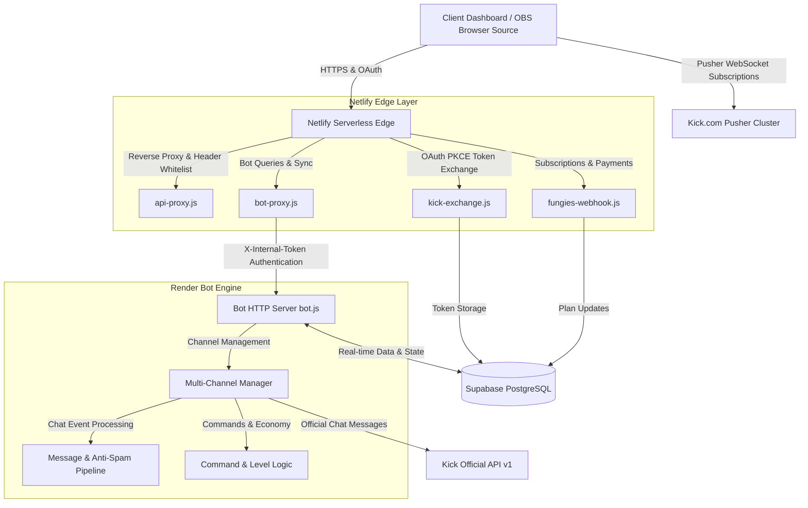

<div align="center">
  <a href="https://kickall.app">
    
  </a>
  <h1>KickALL Ecosystem</h1>
  <p><b>Comprehensive multi-channel streaming toolkit and ecosystem built exclusively for Kick.com creators and communities.</b></p>

  <p>
    <a href="https://github.com/milan-petkovski/KickALL/actions/workflows/ci.yml">
      
    </a>
    <a href="https://kickall.app">
      
    </a>
    <a href="https://github.com/milan-petkovski/KickALL/blob/main/LICENSE">
      
    </a>
    <a href="https://nodejs.org/">
      
    </a>
    <a href="#code-testing-and-verification">
      
    </a>
  </p>

  <p>
    <b>100% Dedicated to Kick.com</b> &bull; <b>4 Specialized Studios</b> &bull; <b>Real-time WebSocket</b> &bull; <b>PWA Ready</b> &bull; <b>Multi-language Support</b>
  </p>
</div>

---

## Quick Navigation

- [What is KickALL?](#what-is-kickall)
- [Target Audience & Key Benefits](#target-audience--key-benefits)
- [Four Specialized Studios](#four-specialized-studios)
  - [1. Kickot - Chatbot & Auto-Moderation](#1-kickot---chatbot--auto-moderation)
  - [2. Kickaj - Giveaway & Wheel of Fortune](#2-kickaj---giveaway--wheel-of-fortune)
  - [3. Kickan - Live Telemetry & Analytics](#3-kickan---live-telemetry--analytics)
  - [4. Kickov - OBS Overlays & Stream Alerts](#4-kickov---obs-overlays--stream-alerts)
- [System Architecture](#system-architecture)
- [Database Schema (Supabase)](#database-schema-supabase)
- [Security & Data Protection](#security--data-protection)
- [Local Installation & Setup](#local-installation--setup)
  - [Prerequisites](#prerequisites)
  - [1. Setting up the Bot Service (Bot/)](#1-setting-up-the-bot-service-bot)
  - [2. Setting up the Web Application (Website/)](#2-setting-up-the-web-application-website)
- [Code Testing and Verification](#code-testing-and-verification)
- [License & Support](#license--support)

---

## What is KickALL?

**KickALL** is an end-to-end web and server ecosystem engineered from scratch for creators on **Kick.com**. Unlike generic legacy solutions designed for Twitch, KickALL interfaces directly with Kick API services and real-time Pusher WebSocket infrastructure.

The platform empowers streamers to manage chat auto-moderation, host provably fair giveaways, monitor viewer velocity in real time, and broadcast dynamic OBS overlay alerts with natural text-to-speech synthesis for donations and subscriptions—all from a single unified hub.

---

## Target Audience & Key Benefits

| Role                                 | Key Capabilities & Value                                                                                                                                                            |
| :----------------------------------- | :---------------------------------------------------------------------------------------------------------------------------------------------------------------------------------- |
| **Streamers (Beginners & Partners)** | Streamline complete stream operations: automated spam filtering, viewer watchtime rewards, interactive giveaway wheels, professional OBS alerts, and real-time broadcast telemetry. |
| **Channel Moderators**               | Instant moderation commands, automated filters against harassment and raid attacks, real-time audit logging for bans and timeouts.                                                  |
| **Viewers & Community**              | Earn XP and level up via watchtime, engage with interactive chat commands (`!points`, `!top`, `!gamble`), participate in mini-games, and enter fair prize draws.                    |

---

## Four Specialized Studios

The KickALL suite consists of four purpose-built studios accessible from the main dashboard:

### 1. Kickot - Chatbot & Auto-Moderation

_Direct link:_ [`https://kickall.app/kickot/`](https://kickall.app/kickot/)

- **Anti-Spam & Anti-Raid Shield**: Intelligent detection of repeated phrases, message flooding, and automatic stripping of hidden zero-width characters used to bypass word filters.
- **Custom Commands (`!commands`)**: Build unlimited custom commands with cooldown protection, granular permission tiers (everyone, subscriber, moderator, broadcaster), and dynamic variables (`{user}`, `{targ}`, `{count}`).
- **Watchtime Economy & Leaderboards**: Automated viewer tracking, custom XP progression, and live rankings for the most active community members.
- **Minigames & Entertainment**: Interactive audience engagement features like coin flips, point gambles, and duel challenges.

### 2. Kickaj - Giveaway & Wheel of Fortune

_Direct link:_ [`https://kickaj.kickall.app/`](https://kickaj.kickall.app/) or [`https://kickall.app/kickaj/`](https://kickall.app/kickaj/)

- **Interactive Wheel of Fortune**: High-performance 60 FPS HTML5 Canvas spinning wheel with physics-driven friction, mechanical clicking audio, and confetti particle celebration.
- **Rule-Based Winner Extraction**: Filter participants by custom keyword, apply subscriber luck multipliers, and exclude automated bots.
- **Anti-Cheat Validation**: Disallow duplicate submissions from identical accounts and verify live presence in chat at the moment of the draw.

### 3. Kickan - Live Telemetry & Analytics

_Direct link:_ [`https://kickan.kickall.app/`](https://kickan.kickall.app/) or [`https://kickall.app/kickan/`](https://kickall.app/kickan/)

- **Chat Velocity Gauge**: Real-time calculation of chat messages per minute (msg/min) with a dynamic visual speedometer.
- **24-Hour Activity Histogram**: Visual breakdown of chat volume across hourly buckets to pinpoint peak viewer engagement.
- **Top Emote & Chatter Insights**: Track trending emotes and identify the most active chatters during any stream session.
- **One-Click Export**: Export full session telemetry and chat logs to CSV and plain text formats.

### 4. Kickov - OBS Overlays & Stream Alerts

_Direct link:_ [`https://kickov.kickall.app/`](https://kickov.kickall.app/) or [`https://kickall.app/kickov/`](https://kickall.app/kickov/)

- **OBS Studio Browser Source**: Generate private, tamper-proof overlay tokens that plug directly into OBS without requiring a login inside the streaming software.
- **Customizable Alerts**: Visual banners and sound effects for new followers, subscriptions, hosts, and donations.
- **Natural TTS Engine**: High-fidelity text-to-speech voice synthesis for donation messages with multi-language pronunciation support.
- **Live Preview Simulator**: Test every alert type inside the dashboard prior to going live on stream.

---

## System Architecture

KickALL operates on a distributed hybrid architecture ensuring zero perceptible latency and fault tolerance:



---

## Database Schema (Supabase)

Data persistence is powered by Supabase PostgreSQL with strict Row Level Security (RLS) policies:

| Table                 | Purpose & Description                                                                    | Key Columns                                                                |
| :-------------------- | :--------------------------------------------------------------------------------------- | :------------------------------------------------------------------------- |
| **`user_profiles`**   | User credentials, avatar URLs, Kick broadcaster accounts, and active subscription status | `id`, `email`, `kick_username`, `plan`, `subscription_status`              |
| **`bot_config`**      | Per-channel bot configuration and preferences                                            | `channel_id`, `bot_active`, `currency_name`, `xp_per_msg`, `prefix`        |
| **`custom_commands`** | User-defined chat commands with authorization levels and timers                          | `channel_id`, `command_name`, `response_text`, `user_level`, `cooldown_ms` |
| **`leaderboard`**     | Viewer watchtime records, collected points, and XP progression tiers                     | `channel_id`, `username`, `points`, `xp`, `level`, `watchtime_minutes`     |
| **`bot_kick_tokens`** | Encrypted OAuth tokens for sending messages securely through the Kick API                | `channel_id`, `access_token`, `refresh_token`, `expires_at`                |
| **`rate_limits`**     | Atomic request counters to prevent API abuse and DDoS attacks                            | `key`, `request_count`, `window_start`, `updated_at`                       |

---

## Security & Data Protection

1. **Fail-Closed Architecture (`X-Internal-Token`)**: Internal requests between serverless edge proxies and backend bot containers require a pre-shared cryptographically strong token. Missing or invalid tokens result in immediate `401 Unauthorized` responses.
2. **SSRF Prevention & Domain Whitelisting**: Netlify proxy endpoints strictly validate destination URLs and only route traffic to allowed destinations (`kick.com` and configured internal bot endpoints).
3. **PII Masking**: Broadcaster and viewer email addresses and credentials are automatically scrubbed and masked in all system logs (e.g., `m***n@domain.com`).
4. **Anti-Injection & Unicode Stripping**: Removal of invisible Unicode zero-width sequences prevents ban-evasion exploits and payload tampering in chat.

---

## Local Installation & Setup

### Prerequisites

- **Node.js**: Version 20.x or 22.x LTS
- **npm**: Version 10.x or newer
- **Git**

### 1. Setting up the Bot Service (`Bot/`)

Create your local `.env` configuration file in the `Bot/` directory:

```bash
cp Bot/.env.example Bot/.env
```

Configure the environment variables in `Bot/.env`:

```env
SUPABASE_URL=https://your-project.supabase.co
SUPABASE_KEY=your-supabase-service-role-key
KICK_CLIENT_ID=your-kick-oauth-client-id
KICK_CLIENT_SECRET=your-kick-oauth-client-secret
INTERNAL_API_SECRET=your-secure-internal-token
PORT=3000
```

Install dependencies and start the bot service:

```bash
cd Bot
npm install
npm start
```

### 2. Setting up the Web Application (`Website/`)

Create `.env` for serverless edge functions inside `Website/`:

```bash
cp Website/.env.example Website/.env
```

Start the local web server:

```bash
# From the repository root
npm run dev
```

The application will be accessible at `http://localhost:5500`.

To run Netlify edge functions locally:

```bash
npm run dev:netlify
```

---

## Code Testing and Verification

The project utilizes the native Node.js test runner for rapid, zero-overhead automated verification without heavy third-party runners.

| Command                     | Description                                                                                                                   |
| :-------------------------- | :---------------------------------------------------------------------------------------------------------------------------- |
| **`npm test`**              | Runs the full suite of **57 automated tests** (bot mechanics, anti-spam filters, serverless functions, and security proxies). |
| **`npm run test:bot`**      | Runs tests isolated to the Bot server and chat processing engine.                                                             |
| **`npm run test:website`**  | Runs tests for Netlify serverless functions, webhook signatures, and rate limiters.                                           |
| **`npm run test:coverage`** | Produces a detailed test coverage report.                                                                                     |
| **`npm run lint`**          | Runs ESLint analysis using the modern flat configuration standard (`eslint.config.js`).                                       |
| **`npm run verify`**        | Performs static asset and integrity validation across all web dashboards.                                                     |
| **`npm run audit`**         | Audits npm dependencies with security thresholds focused on high/critical vulnerabilities.                                    |

---

## ☕ The Story & Support

Hi! I am Milan, a 20-year-old student and web developer from Serbia. I engineered the KickALL ecosystem from scratch to give Kick.com creators, moderators, and communities high-performance, real-time tools without the complexity of legacy software.

If KickALL helps you grow your channel or streamlines your broadcast workflow, and you want to support my late-night coding sessions, you can buy me a coffee!

💖 [Support my work via PayPal](https://paypal.me/milanwebportal)

Every donation means a lot and directly supports server infrastructure, Pusher real-time capacity, and continuous feature development. Thank you!

---

## License & Author

This project is open-source software licensed under the [MIT License](LICENSE).

- **Author & Maintainer**: Milan Petkovski
- **Official Website**: [https://kickall.app](https://kickall.app)
- **Contact & Support**: `contact@milanwebportal.com`
- **Parent Network**: [Milan Web Portal](https://milanwebportal.com)
- **Support the Project**: [Support via PayPal](https://paypal.me/milanwebportal)
