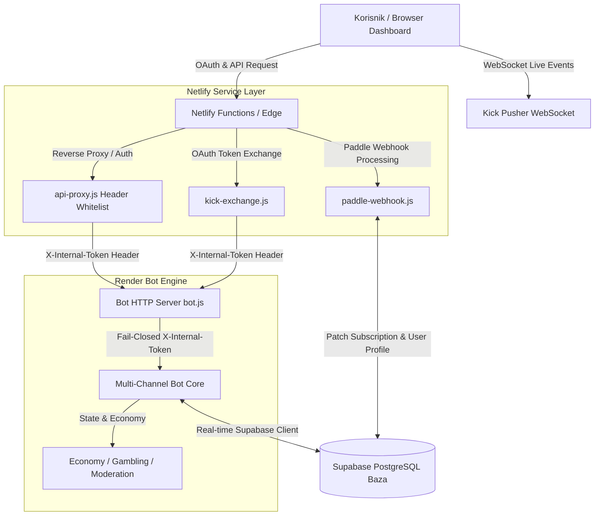

# KickALL Ecosystem 🚀

**KickALL** je kompletan multi-channel Kick.com bot i web ekosistem dizajniran za strimere i zajednice. Sistem uključuje interaktivnog bota sa sistemom nivoa, ekonomijom, kazino igrama, moderacijom i naprednim dashboard-om za upravljanje.

---

## 🏗️ Arhitektura Ekosistema



---

## 🗄️ Šema Baze Podataka (Supabase Schema)

- **`bot_config`**: Konfiguracija bota po kanalu (channel_id, channel_name, bot_active, currency_name, xp_per_msg, points_per_msg, gamble_enabled, max_gamble_amount, prefix, etc.).
- **`custom_commands`**: Prilagođene komande kanala (channel_id, command_name, response_text, user_level, cooldown_ms, is_active).
- **`user_profiles`**: Korisnički nalozi i pretplate (id, username, plan, plan_period, subscription_status, paddle_subscription_id, paddle_customer_id).
- **`leaderboard`**: Bodovi i XP gledalaca (channel_id, username, xp, level, points, watchtime).
- **`rate_limits`**: Atomsko praćenje limita zahteva (key, request_count, window_start, updated_at).

---

## 🔒 Bezbednost & Autentikacija

- **Fail-Closed Shared Secret (`X-Internal-Token`)**: Bot HTTP API štiti sve operativne i administrativne rute (`/api/kick/test-ping`, `/api/kick/reload`, `/api/kick/logs`, `/api/kick/channel`, `/api/kick/check-moderator`, `/api/channels`, `/api/global-logout`). Ukoliko tajni ključ nije podešen ili se ne poklapa, zahtev se odmah odbija sa 401 Unauthorized.
- **Proxy Header Whitelist**: Netlify proxy (`api-proxy.js`) filtrira zaglavlja klijenta prema strogoj beloj listi (`content-type`, `authorization`, `accept`, `accept-language`, `user-agent`) kako bi sprečio SSRF i zloupotrebu tajni.
- **PII Protection**: Osetljivi korisnički podaci (poput email adresa u Paddle webhook logovima) se automatski maskiraju pre ispisa.

---

## 🛠️ Podešavanje Okruženja

### 1. Bot podešavanje (`Bot/`)

Kopirajte `.env.example` u `.env` unutar `Bot/` foldera:
```bash
cp Bot/.env.example Bot/.env
```
Popunite tražene promenljive (`SUPABASE_URL`, `SUPABASE_KEY`, `KICK_CLIENT_ID`, `KICK_CLIENT_SECRET`, `INTERNAL_API_SECRET`).

Pokretanje bota lokalno:
```bash
cd Bot
npm install
npm start
```

### 2. Website & Serverless podešavanje (`Website/`)

Kopirajte `.env.example` u `.env` unutar `Website/` foldera ili podesite promenljive na Netlify kontrolnoj tabli:
```bash
cp Website/.env.example Website/.env
```

---

## 🧪 Testiranje, CI/CD i Dokumentacija

Projekat koristi ugrađeni Node.js 22 nativni test runner.

Pokretanje svih testova (23 testne jedinice):
```bash
npm test
```

Generisanje izveštaja o pokrivenosti koda (Coverage):
```bash
npm run test:coverage
```

Lintovanje i provera stila koda:
```bash
npm run lint
```

Gradnja i statička verifikacija resursa:
```bash
npm run build
```

GitHub Actions pipeline (`.github/workflows/ci.yml`) automatski izvršava lintovanje, sve unit testove i striktnu `npm audit` proveru pri svakom push-u.

Za više detalja o doprinosu projektu, pogledajte [CONTRIBUTING.md](file:///c:/Users/milan/Documents/KickALL/CONTRIBUTING.md).
OpenAPI specifikacija Bot HTTP ruta se nalazi u [docs/openapi.yaml](file:///c:/Users/milan/Documents/KickALL/docs/openapi.yaml).
