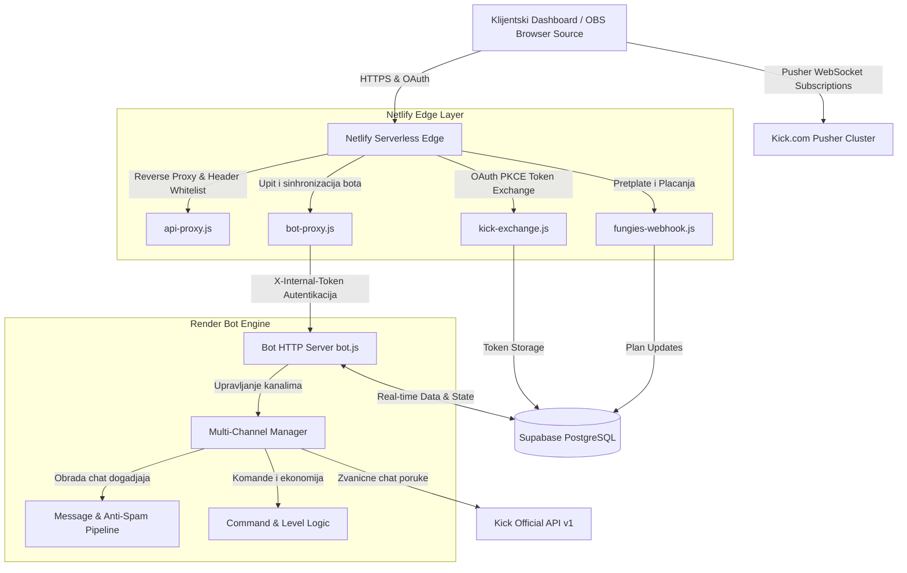

<div align="center">
  <a href="https://kickall.app">
    
  </a>
  <h1>KickALL Ecosystem</h1>
  <p><b>Kompletan multi-channel ekosistem alata za Kick.com strimere i zajednice</b></p>

  <p>
    <a href="https://github.com/milan-petkovski/KickALL/actions/workflows/ci.yml">
      
    </a>
    <a href="https://kickall.app">
      
    </a>
    <a href="https://github.com/milan-petkovski/KickALL/blob/main/LICENSE">
      
    </a>
    <a href="https://nodejs.org/">
      
    </a>
    <a href="#testiranje-i-verifikacija-koda">
      
    </a>
  </p>

  <p>
    <b>100% Namenski za Kick.com</b> &bull; <b>4 Specijalizovana Studija</b> &bull; <b>Real-time WebSocket</b> &bull; <b>PWA Podrska</b> &bull; <b>Srpski i Engleski Jezik</b>
  </p>
</div>

---

## Brza navigacija

- [Sta je KickALL?](#sta-je-kickall)
- [Cemu sluzi i kome je namenjen?](#cemu-sluzi-i-kome-je-namenjen)
- [Cetiri specijalizovana studija](#cetiri-specijalizovana-studija)
  - [1. Kickot - Chatbot i automatska moderacija](#1-kickot---chatbot-i-automatska-moderacija)
  - [2. Kickaj - Giveaway i tocak srece](#2-kickaj---giveaway-i-tocak-srece)
  - [3. Kickan - Telemetrija i analitika uzivo](#3-kickan---telemetrija-i-analitika-uzivo)
  - [4. Kickov - OBS Overlay i alerti](#4-kickov---obs-overlay-i-alerti)
- [Arhitektura sistema](#arhitektura-sistema)
- [Sema baze podataka (Supabase)](#sema-baze-podataka-supabase)
- [Bezbednost i zastita podataka](#bezbednost-i-zastita-podataka)
- [Lokalno pokretanje i instalacija](#lokalno-pokretanje-i-instalacija)
  - [Preduslovi](#preduslovi)
  - [1. Podesavanje Bot servisa (Bot/)](#1-podesavanje-bot-servisa-bot)
  - [2. Podesavanje Web aplikacije (Website/)](#2-podesavanje-web-aplikacije-website)
- [Testiranje i verifikacija koda](#testiranje-i-verifikacija-koda)
- [Licenca i podrska](#licenca-i-podrska)

---

## Sta je KickALL?

**KickALL** je sveobuhvatna veb i serverska platforma izgradjena od nule za strimere na platformi **Kick.com**. Za razliku od generickih resenja namenjenih Twitch-u, KickALL direktno komunicira sa Kick API servisima i Pusher WebSocket infrastrukturom u realnom vremenu.

Sistem omogucava strimerima da sa jednog centralnog mesta kontrolisu moderaciju chata, organizuju nagradne igre (giveaways), analiziraju brzinu i ponasanje gledalaca, i emituju dinamicne OBS overlay efekte sa glasovnom sintezom donacija i pretplata.

---

## Cemu sluzi i kome je namenjen?

| Korisnicka uloga                    | Kljucne prednosti i mogucnosti                                                                                                                                                           |
| :---------------------------------- | :--------------------------------------------------------------------------------------------------------------------------------------------------------------------------------------- |
| **Strimeri (Pocetnici i Partneri)** | Automatizacija kompletnog stream menadzmenta: ciscenje spama, nagradjivanje vernih pratilaca poenima, tocak srece za giveaway, profesionalni OBS alerti i uvid u realnu metriku prenosa. |
| **Moderatori kanala**               | Brze komande za sankcionisanje, automatski filteri protiv uvreda i raid napada, evidencija banova i privremenih zabrana chata u realnom vremenu.                                         |
| **Gledaci i Zajednica**             | Sakupljanje XP poena i nivoa gledanjem (watchtime), ucesce u interaktivnim komandama (`!points`, `!top`, `!gamble`), mini-igrama i fer izvlacenjima nagrada.                             |

---

## Cetiri specijalizovana studija

Ekosistem se sastoji od 4 uskladjena modula kojima se pristupa putem centralnog kontrolnog panela:

### 1. Kickot - Chatbot i automatska moderacija

_Direktan pristup:_ [`https://kickall.app/kickot/`](https://kickall.app/kickot/)

- **Anti-Spam i Anti-Raid zastita**: Inteligentno prepoznavanje ponovljenih poruka, prebrzog kucanja i uklanjanje zero-width karaktera koji sluze za zaobilazenje filtera.
- **Prilagodjene komande (`!commands`)**: Kreiranje neogranicenog broja komandi sa cooldown zastitom, nivoima pristupa (svi, sub, mod, vlasnik) i automatskim tagovima (`{user}`, `{targ}`, `{count}`).
- **Watchtime ekonomija i rang liste**: Automatsko pracenje vremena provedenog na strimu, dodela XP poena i rangiranje najaktivnijih clanova zajednice.
- **Kazino i mini-igre**: Interaktivne komande za zabavu publike tokom prenosa (kockanje poena, duel izazovi).

### 2. Kickaj - Giveaway i tocak srece

_Direktan pristup:_ [`https://kickaj.kickall.app/`](https://kickaj.kickall.app/) ili [`https://kickall.app/kickaj/`](https://kickall.app/kickaj/)

- **Interaktivni tocak srece (Wheel of Fortune)**: Realistican 60 FPS Canvas rendering tocka sa fizikom trenja, zvukom kuckanja i animacijom konfeta.
- **Izvlacenje dobitnika po pravilima**: Filtriranje ucesnika po kljucnoj reci, automatsko prepoznavanje pretplatnika (sub multiplikatori sanse) i iskljucivanje botova.
- **Anti-Cheat validacija**: Zabrana visestrukih prijava sa istog naloga i provera da li je ucesnik trenutno prisutan na chatu.

### 3. Kickan - Telemetrija i analitika uzivo

_Direktan pristup:_ [`https://kickan.kickall.app/`](https://kickan.kickall.app/) ili [`https://kickall.app/kickan/`](https://kickall.app/kickan/)

- **Brzinomer chata (Velocity)**: Kalkulacija broja poruka u minuti u realnom vremenu (msg/min) sa grafickim meracem intenziteta.
- **24-casovni histogram aktivnosti**: Graficki prikaz raspodele chat saobracaja po satima za identifikaciju pikova gledanosti.
- **Top Emote i Chatter telemetrija**: Analiza najkoriscenijih smajlija/emotikona i rang lista najglasnijih gledalaca tokom sesije.
- **Izvoz podataka**: Preuzimanje kompletnih izvestaja sesije u CSV i tekstualnom formatu jednim klikom.

### 4. Kickov - OBS Overlay i alerti

_Direktan pristup:_ [`https://kickov.kickall.app/`](https://kickov.kickall.app/) ili [`https://kickall.app/kickov/`](https://kickall.app/kickov/)

- **OBS Studio Browser Source**: Generisanje jedinstvenog bezbednog tokena koji se direktno ubacuje u OBS kao izvor bez potrebe za prijavom.
- **Prilagodljivi alerti**: Vizuelna i zvucna obavestenja za nove pratioce (followers), pretplatnike (subs), hostove i donacije.
- **TTS Sinteza govora**: Citanje poruka donacija prirodnim glasom sa podrskom za srpski (`sr-RS`) i engleski (`en-US`) jezik.
- **Live Preview tester**: Simulacija svakog tipa dogadjaja unutar dashboard-a pre emitovanja uzivo.

---

## Arhitektura sistema

KickALL funkcionise kroz distribuiranu hibridnu arhitekturu koja garantuje nulto kasnjenje i visoku otpornost na prekide:



---

## Sema baze podataka (Supabase)

Baza podataka koristi PostgreSQL na Supabase platformi sa strogim Row Level Security (RLS) pravilima:

| Tabela                | Opis i namena                                                            | Kljucne kolone                                                             |
| :-------------------- | :----------------------------------------------------------------------- | :------------------------------------------------------------------------- |
| **`user_profiles`**   | Korisnicki nalozi, profilne slike, Kick nalozi i status plana pretplate  | `id`, `email`, `kick_username`, `plan`, `subscription_status`              |
| **`bot_config`**      | Individualna konfiguracija ponašanja bota za svaki pojedinacni kanal     | `channel_id`, `bot_active`, `currency_name`, `xp_per_msg`, `prefix`        |
| **`custom_commands`** | Korisnicki definisane komande strimera sa nivoima autorizacije           | `channel_id`, `command_name`, `response_text`, `user_level`, `cooldown_ms` |
| **`leaderboard`**     | Evidencija watchtime vremena, skupljenih poena i XP nivoa gledalaca      | `channel_id`, `username`, `points`, `xp`, `level`, `watchtime_minutes`     |
| **`bot_kick_tokens`** | Enkriptovani OAuth tokeni bota radi bezbednog slanja poruka preko API-ja | `channel_id`, `access_token`, `refresh_token`, `expires_at`                |
| **`rate_limits`**     | Atomsko pracenje frekvencije zahteva radi prevencije zloupotrebe         | `key`, `request_count`, `window_start`, `updated_at`                       |

---

## Bezbednost i zastita podataka

1. **Fail-Closed zastita (`X-Internal-Token`)**: Interna komunikacija izmedju serverless proxy funkcija i pozadinskog bot servisa zasticena je zajednickom tajnom. Ako tajna nedostaje ili je nevazeca, zahtev se odbija odmah sa statusom `401 Unauthorized`.
2. **SSRF prevencija i bela lista domena**: Netlify proxy funkcije vrse strogu proveru ciljnih URL adresa i prosledjuju zahteve iskljucivo ka ovlascenim domenima (`kick.com` i konfigurisanom internom servisu bota).
3. **Zastita privatnosti (PII Masking)**: Korisnicki identifikatori i email adrese u sistemskim logovima se automatski maskiraju (npr. `m***n@domain.com`).
4. **Zastita od spam napada**: Uklanjanje nevidljivih Unicode i zero-width karaktera sprecava zloupotrebu i zaobilazenje zabranjenih reci na chatu.

---

## Lokalno pokretanje i instalacija

### Preduslovi

- **Node.js**: Verzija 20.x ili 22.x LTS
- **npm**: Verzija 10.x ili novija
- **Git**

### 1. Podesavanje Bot servisa (`Bot/`)

Kreirajte lokalnu `.env` konfiguracionu datoteku u `Bot/` folderu:

```bash
cp Bot/.env.example Bot/.env
```

Popunite potrebne promenljive u `Bot/.env`:

```env
SUPABASE_URL=https://your-project.supabase.co
SUPABASE_KEY=your-supabase-service-role-key
KICK_CLIENT_ID=your-kick-oauth-client-id
KICK_CLIENT_SECRET=your-kick-oauth-client-secret
INTERNAL_API_SECRET=your-secure-internal-token
PORT=3000
```

Instalirajte zavisnosti i pokrenite bot:

```bash
cd Bot
npm install
npm start
```

### 2. Podesavanje Web aplikacije (`Website/`)

Kreirajte `.env` za serverske funkcije unutar `Website/`:

```bash
cp Website/.env.example Website/.env
```

Pokretanje lokalnog veb servera:

```bash
# Iz korena repozitorijuma
npm run dev
```

Aplikacija ce biti dostupna na adresi `http://localhost:5500`.

Za testiranje Netlify funkcija lokalno:

```bash
npm run dev:netlify
```

---

## Testiranje i verifikacija koda

Projekat koristi Node.js nativni test runner bez eksternih glomaznih testnih biblioteka, obezbedjujuci maksimalnu brzinu izvrsavanja.

| Naredba                     | Opis izvrsavanja                                                                                                        |
| :-------------------------- | :---------------------------------------------------------------------------------------------------------------------- |
| **`npm test`**              | Pokrece kompletnu bateriju od **57 automatizovanih testova** (Bot logika, anti-spam, serverless funkcije, API zastite). |
| **`npm run test:bot`**      | Pokrece iskljucivo testove vezane za Bot server i mehaniku chata.                                                       |
| **`npm run test:website`**  | Pokrece testove vezane za Netlify funkcije, webhook validaciju i rate limiting.                                         |
| **`npm run test:coverage`** | Generise detaljan izvestaj pokrivenosti koda testovima.                                                                 |
| **`npm run lint`**          | Pokrece ESLint proveru koda prema najnovijem flat config standardu (`eslint.config.js`).                                |
| **`npm run verify`**        | Statička verifikacija integriteta svih veb resursa i 4 kontrolne table.                                                 |
| **`npm run audit`**         | Proverava bezbednost svih instaliranih paketa sa pragom na visokom nivou rizika.                                        |

---

## Licenca i podrska

Ovaj projekat je licenciran pod [MIT Licencom](LICENSE).

- **Autor i odrzavalac**: Milan Petkovski
- **Zvanicni vebsajt**: [https://kickall.app](https://kickall.app)
- **Kontakt i podrska**: `contact@milanwebportal.com`
- **Povezani portal**: [Milan Web Portal](https://milanwebportal.com)
